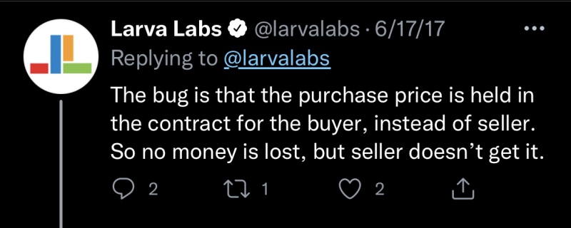
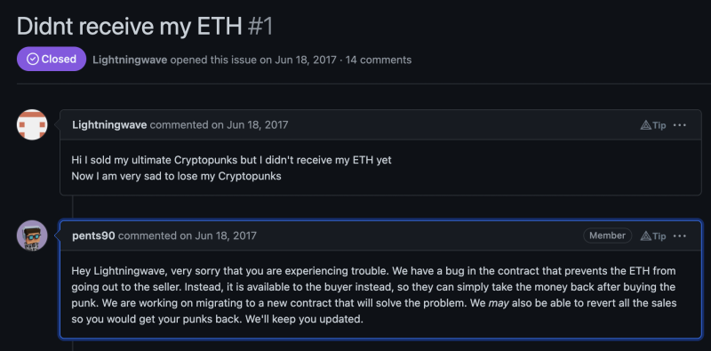
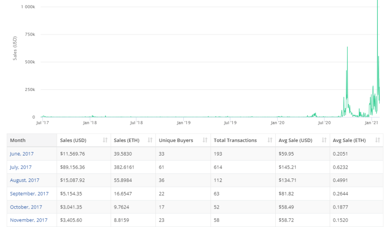
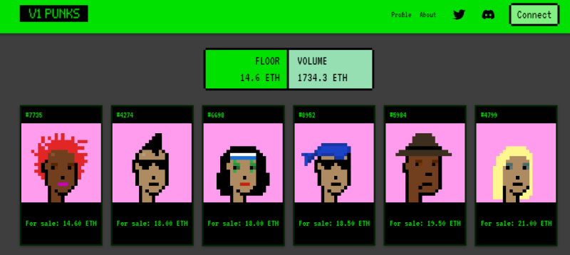
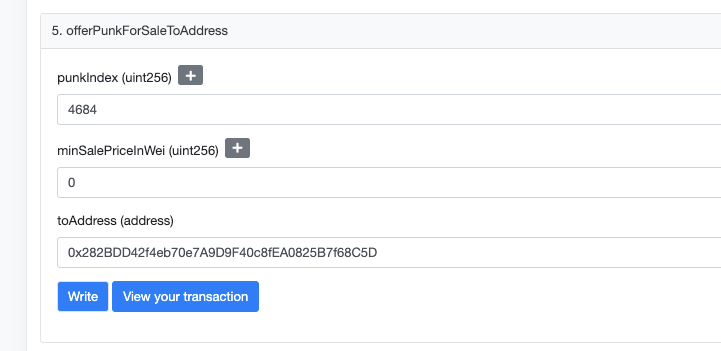
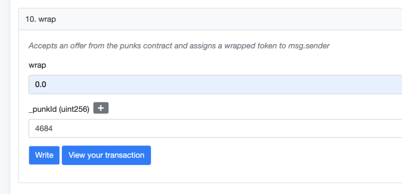
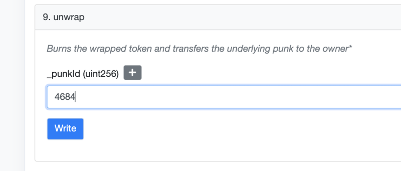

# (Crypto) Punks, V1 - The Historic First Edition (Anno 2017 - June 9th)

**Update**   Let's begin the story with 
the pseudonymous Hemba crypto bro millionaire and the (public) head / lead of the V1 punks.

via [The Cult of Cryptopunks](https://techcrunch.com/2021/04/08/the-cult-of-cryptopunks/)

> Some users went all-in immediately. 
> One user that went by the username "Hemba" has become something of a cautionary figure in the cryptopunks community, 
> claiming more than 1000 punks at launch and selling every one of them before the market took off this year [2021],
> missing out on tens of millions of dollars in profits at current prices. 

via [The Early Cryptopunk Seller Whose Collection Would Be Worth $438M](https://www.actionnetwork.com/crypto/cryptopunk-investor-percent-return-seller-collection-million) 

> One user, whose name on Opensea is "Hemba," did get in early enough and claimed many of the early punks for free.
>
> "Hemba" alone sold more than 10 percent of all punks - 1058 to be exact. And many of them, he or she flipped in the first six months for the quick buck. 
>
> Hemba made $3.3 million off the sale of these punks,
> which, by all standards is really impressive. Then again, that’s a sale price average 
> of $3137, which means that, had Hemba held on to those punks, 
> they would have been worth at least $437.8 million at today’s floor.

So far so good - what's missing in the crypto bro's picture?

via [Jonathan Mann - A Song A Day - A Cryptopunk Civil War is brewing because of a very old exploit. I've dramatized the brouhaha in a rock opera w/ The Christie's Punks](https://twitter.com/songadaymann/status/13910933811498885)

> Way back in the beginning, in the summer of '17, there was a bug in the punks' 
> contract that made it so when someone bought a punk, 
> the buyer got both the PUNK AND THE MONEY, leaving the seller with nothing.
>
> Dude called Hemba stole A TON of punks this way.
>
> Larva Labs were alerted to the exploit & launched 
> a fixed contract that reverted everyone's punks to where they were before.
>
> It was the PunkHardFork, and everyone accepted the fork as the TruePunks.
>
> But of course: Immutability. V1 punks still exist, in a way.
>
> Now, Hemba, who sold all his many v2 punks at low (all under 1 ETH) prices,
> has been concocting a wrapper + marketplace 
> in an attempt to offload the bevy of V1 punks he stole.
>
> That being said, my song is from the perspective of the v1 punks. 
>
> From a story-standpoint, I've always loved imagining 
> these poor lost punks, drifting in the ether (much like the mooncats lost on the moon).
>
> I do think they deserve a place of honor in the museum of punk lore but
> because of the way they were fenced back in the day, it's not right 
> for Hemba to try to flip them now. That's just shady.
>
> My favorite part of punks has always been the stories that come out of the community. 
>
> Stories, more than anything else, is what makes punks, punks.
> 
> And the truth is that the question "What exactly ARE V1 Punks?" is actually quite
> philosophically complicated, and how you answer that question has profound
> implications for [non-fungible] tokens in general. It touches on things like
>
> - Code Is Law
> - Authorial Intent
> - Immutability
> - Consensus

Note: This following text was originally copied from the [**V1 and V2 Punk (Wiki) Pages**](https://v1punks.gitbook.io) written I assume all by
the pseudonymous Hemba crypto bro millionaire.  Over time I try to edit more and any help on errors and corrents are more than welcome.  Onwards.

The CryptoPunks launched June, 9th 2017
to little fanfare and were completely free for anyone to claim via an Ethereum contract. Over a week went by before the full 10 000 were claimed by over a hundred keen crypto-goers. Soon after, a small but critical issue was identified within the smart contract once listings began to appear. The method offerpunkforsale was not correctly coded and users were able to 'purchase' a punk, exchanging their ETH
for the listed punk, then execute the withdraw command
and receive the ETH that was paid to the contract. That ETH should not have been accessible to the buyer but only to the seller (as it is today with the v2 contract).

The issue with the contract was caused by one line of code:

The well-known early punk claimer [Hemba](https://twitter.com/soldthebottom),
in the course of a legitimate purchase, discovered this exploit and used it to heist a couple dozen punks listed for sale. Hemba has since returned more than 30 v1 punks heisted in that exploit including the extremely rare (and historic) v1 punk #6487.
Abound with glee and excitement, the Discord channel soon realised that these several 1, 10 and 100 ETH sales (ETH was ~$300 at the time) on the first day of trading were not legitimate but the cause of major concern.

Owners were then warned not to interact with their punks until the developers worked out a solution to this issue.
Larva Labs alerted the public to the bug via this update:

In the days following, Larva Labs issued a new contract with the bug removed and added bid functions.
On June 23rd 2017, they 're-minted' all of the punks and airdropped them back to their rightful owners. Note that all 10 000 punks and their IDs are identical between both versions of the contract. v1 and v2 Punks are identical in their aesthetic, though non-fungible and unique in their tokening.

## 2017-2020 - The Dark Ages for Punks

There isn't much to say regarding this time period for cryptopunks save for a few sweeps and pumps from the minority of people who were aware of them. [Non-fungible] tokens and crypto went through a deep, cold and long bear market. Buyers, bidders, sellers and attention was scarce.
It really wasn't until September of 2020 where one could see a marked spike in social interest and sales.

For reference, here's an All-Time CryptoPunks sales volume, data, graphs, & charts:

Source: [cryptoslam.io/cryptopunks/sales/summary](https://www.cryptoslam.io/cryptopunks/sales/summary)

## Resurgence of v1 Punks

With the recent meteoric rise and attention on historical [non-fungible] tokens, v1 punks has piqued the interest of
'[non-fungible] token archaeologists',
collectors and speculators. Although there has always been a small minority who have known of v1 Punks' existence, only recently have they come to the fore.

To be clear, v1 punks are the original and first contract created by Larvalabs and preceded their famous cryptopunks [non-fungible] tokens. They are identical to their v2 brothers and thanks to a new wrapper they can be wrapped as ERC-721s and safely traded on popular  marketplaces. They are not derivatives, nor copies nor fakes.
The v1 punks contract immutably exists on the blockchain and their provenance is without dispute.

For a long time v1's went under the radar, only traded sporadically in private transactions. In early 2017 [@0xfoobar](https://twitter.com/0xfoobar) created a 'wrapper contract', a way to wrap the tokens into ERC-721 compliant tokens and patch over the contract bug. The wrapper imparted a slight change to the image (adding a reddish-orange ribbon in the top left) but leaving the core image intact.

More recently an improved wrapper was developed
by [@FrankPoncelet](https://twitter.com/FrankPoncelet)
and [@simo_eth](https://twitter.com/simo_eth) to match a dedicated marketplace for v1 punks - [v1punks.io](https://www.v1punks.io/).

With the development of this marketplace and wrapper, the stage is set for v1 punks to make their comeback.

v1 punkers love art and community. They are positive and welcoming. v1's are a polarising topic with some wishing they never existed and others loving that they do. Their history and place in the cryptopunks story cannot be disputed or erased however, and that is significant. The blockchain cannot be reversed.

Per @nftstrategies in this Twitter thread, "What we are buying is attention, in the form of a story. The buyers (of) #v1Punks aren't challenging the power of Larva Labs, we raided their dumpster and found precious treasure. This real, indelible token has one of the best stories of all [non-fungible] tokens and true historic provenance."

## New Wrapper & Marketplace

The new wrapper contract, which offers improvements upon previous iterations, will be supported
by a dedicated fee-less marketplace - [v1punks.io](https://www.v1punks.io/) -
allowing users the opportunity to safely trade and interact with their v1 punks.

How does this wrapper contract work, you wonder? Well, to wrap, you have to safely nestle your ERC-20 v1 punk into the wrapper contract. It spits out a lovely ERC-721 with complete metadata and is then tradable without vulnerability via popular marketplaces. The wrapper colours the background of your punk by default in a soft purple hue and the marketplace will display different colors depending on the current status of the punk, just like Larva Labs' v2 cryptopunks.

Note: Cryptopunks don't actually have a background color
as the art is transparent, so by adding one via the wrapper we aren't modifying the original art, merely differentiating v1's from their v2 brothers to avoid confusion.
Of course, users can unwrap their v1 punk at any time and receive the original, untainted art.

The new marketplace will be the primary hub for safely trading v1's with features added progressively as the project grows in exposure. In addition, users can list, buy, bid and sell for wrapped v1's on popular marketplaces such as OpenSea, LooksRare and Rarible. The new marketplace will also act as insurance policy for v1 punks to survive and thrive, avoiding any sort of third-party censorship on marketplaces, as has been seen in the past with Larva Labs & OpenSea.

New Wrapper Marketplace Links:

- OpenSea @ [official-v1-punks](https://opensea.io/collection/official-v1-punks)
- LooksRare @ [0x282BDD42f4eb70e7A9D9F40c8fEA0825B7f68C5D](https://looksrare.org/collections/0x282BDD42f4eb70e7A9D9F40c8fEA0825B7f68C5D)
- Rarible @ [official-v1-punks](https://rarible.com/official-v1-punks/items)

Old Wrapper Marketplace Links (Note: We highly encourage users to gradually move all v1 Punks onto the newer wrapper):

- Rarible @ [0xf4a4644e818c2843ba0aabea93af6c80b5984114](https://rarible.com/collection/0xf4a4644e818c2843ba0aabea93af6c80b5984114/items)
- LooksRare @ [0xF4a4644E818c2843Ba0AAbEa93af6c80B5984114](https://looksrare.org/collections/0xF4a4644E818c2843Ba0AAbEa93af6c80B5984114)

## Wrapping

One of the most important things that someone who may be interested in buying a v1 punk needs to know is this:

While the v1 punks still exist in their original form, so does the existing bug in the v1 contract! Using the existing wrapper, or the new wrapper and marketplace, gets your punk removed from the old contract, and, as such, the original bug does not exist. Unwrapped v1 punks that are put up for sale are vulnerable to the old bug and the v1 punk could be stolen! Also of note, the transfer functions within the existing v1 contract still function normally, the only bug seems to be selling and buying the punk without it being wrapped.

### How To Wrap Unwrapped v1 Punks

Step 1:

First we go to the original, bugged v1 Punks contract:
<https://etherscan.io/address/0x6Ba6f2207e343923BA692e5Cae646Fb0F566DB8D#writeContract>

You will see a button "Connect to Web3" with a red dot.
Connect with MetaMask or WalletConnect.
Next, we make a PRIVATE sale to the wrapper contract address:

The top field is the Punk you want to wrap. For this example, the Punk ID is: 4684

The middle field is a price: put that to 0

The last field is the WRAPPER contract address: 0x282BDD42f4eb70e7A9D9F40c8fEA0825B7f68C5D

And then hit that blue "Write" button to complete.

IMPORTANT: WAIT FOR THE TRANSACTION TO SUCCEED BEFORE STEP 2

Step 2:

Now we go to the new wrapper contract: <https://etherscan.io/address/0x282bdd42f4eb70e7a9d9f40c8fea0825b7f68c5d#writeContract>

Connect your MetaMask or WalletConnect again.
Now go to the wrap method:

The top field is the ETH to send. As we put 0 in the private sale, we put 0 here too. (Tip: Make sure to input 0, and not 0.0)

The bottom field is for your punk ID again and hit that blue "Write" button to complete.

Voila! Your v1 punk is officially wrapped and good to go.

### How to Unwrap from the Old Wrapper

We go to the @0xfoobar wrapper contract:
<https://etherscan.io/address/0xF4a4644E818c2843Ba0AAbEa93af6c80B5984114#writeContract>

Connect your MetaMask or WalletConnect with the "Connect to Web3" button with a red dot.

Now go to the unwrap method:

Fill in your punk ID number and hit that blue "Write" button to complete.

IMPORTANT: WAIT FOR THE TRANSACTION TO COMPLETE BEFORE YOU WRAP
YOUR NOW-UNWRAPPED PUNK

## V1 Punks in the News

(Crypto) Punk's Not Dead

[**Public Service Announcement - All Punks Are Good Punks - Larva Labs Crypto Bros / Fraudsters Claim Only Its Own Exclusive (Token) Collection Is "Official"**](https://old.reddit.com/r/CryptoPunksDev/comments/sd45x0/public_service_announcement_all_punks_are_good/)

Yesterday - January 25th, 2022 - the Larva Labs Crypto Bros / Fraudsters - Matt Hall and John Watkinson -  posted:

> Public Service [Self-Enrichment] Announcement: CryptoPunks V1.0 are not official
> Cryptopunks. We don't like them [anymore], and we've got 1,000 of
> them [to dump] ... so draw your own conclusions.
> Any proceeds [of the sell-off] will be used to purchase [and pump up the] real Cryptopunks [V2.0]!
>
> -- [Larva Labs Crypto Bros / Fraudsters News](https://twitter.com/larvalabs/status/1486092138534387712?cxt=HHwWgIC-zaS71J8pAAAA)

Why not post a less self-serving public service announcement?  Why not tell the world -  yes, the emperor has no clothes - that is, that the "original" V2 or whatever pixel punks in the 24x24 format are as worthless as the V1 series? What's your take?

PS: For some background, see the legal and con-art / fraudster section in the [**(Pixel) Punk Frequently Asked Questions (F.A.Q.) and Answers**](https://github.com/cryptopunksnotdead/faq).

---

Web3 Is Going Just Great...

[**Co-founder of the team behind Cryptopunks v2 sells all 40 of his  Cryptopunks v1 shortly before the team announces they view them as worthless**](https://web3isgoinggreat.com/?id=2022-01-23-0)

The enormously popular Cryptopunks project, created by the LarvaLabs bros - Matt Hall and John Watkinson, is actually on its second version.
A bug in the original smart contract allowed users to retrieve their money after buying the original [non-fungible] token, allowing people to "steal" the v1 [non-fungible] tokens, and so the project largely faded into obscurity in favor of the patched version 2. However, recently the  marketplace LooksRare allowed a project where people "wrap" their original punks and can trade them properly without encountering the bug. This apparently didn't go over so well with LarvaLabs: on January 25, the project tweeted, "Public Service Announcement (PSA): 'V1 Punks' are not official cryptopunks. We don't like them, and we've got 1000 of them... so draw your own conclusions." However, @NFTethics noticed that one of the LarvaLabs founders sold all 40 punks V1 that he owned between January 23 and 25. Trading them shortly before the project released the tweet declaring they viewed them as worthless sure looks a lot like insider trading. The trades earned the founder a handsome total of 260 ETH (about $625 000). 

---

(Crypto) Punk's Not Dead

[**Lavra Labs Crypto Bros write: We will shutdown the Cryptopunks V1 Project - It has no right to use the art or the name. We will be taking appropriate steps in the coming days [to shutdown the fraudster operation].**](https://old.reddit.com/r/CryptoPunksDev/comments/sizq3i/lavra_labs_crypto_bros_write_we_will_shutdown_the/)

In the ongoing Cryptopunks V1 vs V2 saga crypto millionaire and Lavra Labs Bro Matt Hall writes:

> We originally didn't go after the v1 [Cryptopunks] project
> for copyright infrigement of both the [24x24 pixel] art and the Cryptopunks™
> [trademark] name because we didn't want to give it
> any additional attention,
> but now many Cryptopunks [V2] owners [or is that bagHODLers?]
> have called for us to take action,
> and we agree with them.
> Let there be no confusion about the legitimacy of
> this [**"v1" [Cryptopunks] project [that we started
> and no longer like]**](https://old.reddit.com/r/CryptoPunksDev/comments/sd45x0/public_service_announcement_all_punks_are_good/).
> It has no right to use the [24x24 pixel] art or the Cryptopunks™ [trademark] name.
> We  will be taking appropriate steps in the coming days [to shutdown the operation].

What's your take?   Is this a Bitcoin Classic Maxi v Bitcoin Cash v Bitcoin Satoshi Vision replay?

And more serious questions - [**1) Can you trademark a "generic" crypto name like crypto punks?**](https://old.reddit.com/r/CryptoPunksDev/comments/sjgn9g/q_can_you_trademark_a_generic_name_like_crypto/) I'd say no. Tip: Try to "leverage" your Larva Labs Bros name e.g. try to trademark "Larva Labs Bros' Cryptopunks™" or "Watkinson's Cryptopunks™" or "Matt & Johns' Cryptopunks™" or whatever - that will work IF you start adding the trademark to the name.

Or  [**2) Can you claim the exclusive copyright(s) for trivial 8-bit 24x24 pixel images?**](https://old.reddit.com/r/CryptoPunksDev/comments/sjgpey/q_can_you_claim_the_exclusive_copyrights_for/) I'd say again no.  Again a tip:  Try to "leverage" your "brand" and offer free 3D models or such to bagHODLers to offer some "utility" or assets that you CAN claim and protect as your intellectual property (IP).

And to sum up - if you keep going with your "narrative" from your statement above - let there be no confusion and let's be clear - **you are con artists and crypto bro fraudsters**.

---

(Crypto) Punk's Not Dead

[**V3 Punks Launched - Is This The True Web 3 "Decentralized" 10 000 Punk Edition By The People for The People**](https://old.reddit.com/r/CryptoPunksDev/comments/sjhbgr/v3_punks_launched_is_this_the_true_web_3/)

> The V1 punks claimed provenance through the immutable
> ledger, while V2s claimed superiority through cultural and social
> consensus. The V3 punks are here to continue the punk legacy
> and build upon previous iterations. Not relying on provenance
> nor history as a source of value, V3s will be fully utility driven.
>
> Our [10 000 punks] supply has been fully distributed.
> The V3 movement has officially begun.
>
>
> -- [**V3 Punks**](https://v3punks.io/)

  Yes, the ongoing V1 vs V2 punk saga is now V1 vs V2 vs V3.   Rumor has it that there's a V0 punk collection already out there waiting to be discovered.

  What's your take?  Is V3 Punk the new flagship collection for the decentralized web 3 movement or another  con-art fraudster crypto bro get-rich-quick cash grab?

> Accidentally minted about 50 punks V3. Let's fucking go (LFG).
>
> Kinda tilted I missed the V1 punk train [...], but not missing these
> punks V3. So cheap to mint, like a free claim - laughing out loud (LOL).
>
> Okay #v3 gang. Let's follow each other #v3punks.
>
> Laughing out loud (LOL). Time to buy 100 v3 punks.
>
> Top whale BUYS (last hour): v3 punks: 10 (avg: 0.07 ETH)
>
> v3 punks already flipped some of my quality [non-fungible] tokens,
> gotta love it.  Laughing out loud (LOL).
>
> Punks v3 average price increased to ETH 0.143 (+189.9%) in the last hour.

V3 Phunks or Punks?  Yes, Phree the Phunks!

> - You missed V2 Punks
> - You missed Phunks
> - You missed V1 Punks
> - You missed V3 Punks
>
> Will you miss V3 Phunks too, anon?
>
>  -- [**V3 Phunks**](https://v3phunks.xyz)

To paraphrase [**Trolly McTrollface (Crypto & Art Critique)**](https://old.reddit.com/r/CryptoPunksDev/comments/sg80z1/alpha_alpha_alpha_new_mint_your_own_pixel_punks/):

> I just learned there's a total of 27 million ~monkey jpegs~ punk pngs
> on the blockchain.
> Imagine if every idiot wants one. Do the math.

## Sources

V1 and V2 (Crypto) Punks Wiki <https://v1punks.gitbook.io>

