Looking for Cats?  See the [**Awesome CryptoKitties Bubble (Anno 2017) »**](https://github.com/cryptocopycats/awesome-cryptokitties-bubble)

---


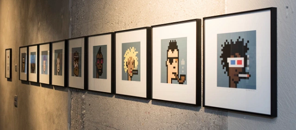


> Someday, owning a CryptoPunk might signify just how early of an
> adopter you were into the world of blockchain and its thriving digital
> art scene. Or, they could just be a bunch of [24×24 pixel] images.
>
> -- [June 2017](https://mashable.com/2017/06/16/cryptopunks-ethereum-art-collectibles/)
>
>
> There will be a desire and need to buy expensive [status symbols]
> in the digital realm [to "flex" how rich and stupid I am].
> What could be more desirable than a small [24×24]
> pixelated [knitted cap-wearing ape] face?
> CryptoPunk artwork [ [#8219](https://www.larvalabs.com/cryptopunks/details/8219)] just sold for $176,000.
>
> -- [January 2021](https://decrypt.co/53519/an-ethereum-based-cryptopunk-artwork-just-sold-for-176000)
>
>
> Ultra-rare alien [24×24 pixel] CryptoPunk
> sells for 605 ETH, or $750,000.
> The investment thesis. "Aliens are the rarest form of CryptoPunk and
> we believe that the acquired Alien [ [#2890](https://www.larvalabs.com/cryptopunks/details/2890), one of nine]
> will be prized by collectors over
> time and mature into an iconic digital art piece."
>
> -- [January 2021](https://cointelegraph.com/news/ultra-rare-alien-cryptopunk-nft-sells-for-605-eth-or-750-000)
>
> CryptoPunks are the Warhols of the digital age.
>
> -- [February 2021](https://twitter.com/beaniemaxi/status/1360788595657818114)
>
> 10 000 CryptoPunks, ≈13 500 Picasso paintings. Do the math.
>
> -- [February 2021](https://twitter.com/0x_Capital/status/1360057260324577281)
>
> CryptoPunks, [Ethereum Edition] are truly priceless - the rookie cards of [digital collectibles] ("non-fungible tokens").
>
> -- Mark Cuban, Billionaire, [February 2021](https://twitter.com/mcuban/status/1358883725321383938)
>
> Our darling [CryptoPunks, Polkadot Edition] ("SubstraPunks")
> are going to be flying out to a [digital collectible] ("non-fungible token")
> exhibition in Beijing and Shanghai next month!
>
>  -- Substra Punkette, [Feburary 2021](https://twitter.com/SubstraPunk/status/1364186937251291144)


**REMINDER: In the digitial world there are no originals! Every copy is a original and you cannot tell the difference
(all 0s and 1s are the same). And, yes, you can always make as many (free) copies as you like (in a free world).
Claiming that you can protect your exclusive rights to pixels because the record of ownership
is stored in a public database is absurd.
Without laws and governments that help you with your rights - the claim is just
a meaningless series of 0s and 1s.  PS: Do you really own CryptoPunks? (Spoiler: No.)
Check your license agreement with LarvaLabs - the pixel art license seller - and do NOT get fooled by the record of ownership.
You are a licensee and NOT an owner.**

> Warning: There is a project called [CryptoPunks, Binance Edition] ("Binance Punks")
> that has taken the art from CryptoPunks and is selling it as a copy on another blockchain.
> This is in no way an authorized [Larva Labs] project.
>
> -- [February 2021](https://twitter.com/larvalabs/status/1364041628508434432)
>
> Isn't an unauthorized edition the true authentic punk edition? Fuck the [Larva Labs $$$] hipsters
> and the [let's "flex" how rich and stupid I am] 24×24 pixel certified proof-of-ownership HODLers!
>
> -- Anonymous Punk


Breaking News - Larva Labs Sending Out Copyright Violation Takedowns - How Punk is That?

> Subject: Digital Millennium Copyright Act (DMCA) Takedown  <br>
> Date July 1, 2021 at 10:51
>
> My name is Mordecai Goldstein and I am the General Counsel of Larva Labs LLC [- a multi-million dollar crypto fraudster operator]. 
> A [digital pixel] image [sold via an unauthorized token] on your site
> is infringing on the copyright/intellectual property owned by our company.
>
> The original [24×24 8-bit pixel] images [that any 6-year old can redraw "by hand" in minutes¹], 
> to which we own exclusive copyrights, can be found at: <https://larvalabs.com/cryptopunks>
>
> The unauthorized and infringing ["punk"] copy can be found at: ...
>
> [...] I seek the removal of the aforementioned infringing material from your servers
> and take down of the site. I request that you immediately notify the infringer
> of this notice and inform them of their duty to remove the infringing material immediately, and
> notify to cease any further posting of infringing material to your service in the future. [...]
>
> Thank you, <br>
> General Consel, Larva Labs LLC
>
> [¹: Yes, You Can! Draw your own free 24×24 avatars that you own 100% forever. Try the [Punk's Not Dead Pixel Drawing Tool](https://cryptopunksnotdead.github.io/) online.]


Discuss:  Can You Copyright Machine-Generated Images? 
Or How "Original" Is a 8-Bit 24×24 Pixel Image That Any 6-Year Old Can Redraw "By Hand" In Minutes?


# Awesome CryptoPunks Bubble (Anno 2021)  - Modern 24×24 Pixel Crypto Art on the Blockchain


## CryptoPunks, Ethereum Edition

10 000 unique collectible characters with proof of ownership stored on the ethereum blockchain.

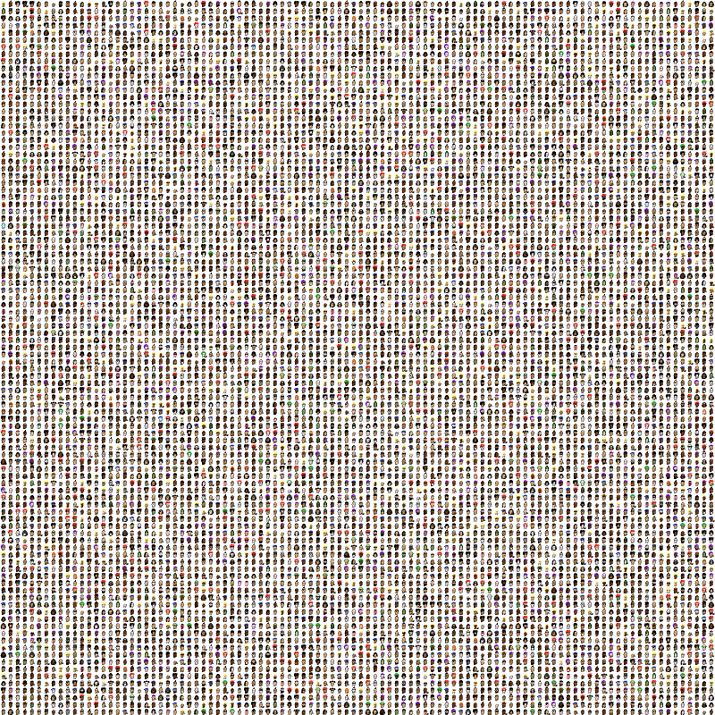


SPOILER:  You can download all 10 000 CryptoPunks
in a 2400×2400 image (~ 830kb) for free.
See [`punks.png` »](https://github.com/larvalabs/cryptopunks/blob/master/punks.png). Yes, the originals¹!


¹: On the blockchain only
the punk index (e.g. 2890, 8219, and so on)
as an integer number gets stored - and
one time only the "Don't Trust, Verify" SHA256 hash
of the all-10 000-punks-in-one image in the [contract code »](https://github.com/cryptopunksnotdead/contracts/tree/master/punks#constants).


Q: What is a CryptoPunk?

The CryptoPunks are 24×24 pixel art images, generated algorithmically. Most are punky-looking guys and girls, but there are a few rarer types mixed in: Apes, Zombies and even the odd Alien. Every punk has their own profile page that shows their attributes as well as their ownership & for-sale status.


Q: Who's behind CryptoPunk?

[Matt Hall](https://github.com/megamattron) and
[John Watkinson](https://github.com/pents90)
from [Larva Labs](https://github.com/larvalabs) in New York City, United States


> We're coming up on two years of the CryptoPunks launch.
> We thought CryptoPunks might be just a blog post, a couple weeks of
> interest and the end of it - and it's still going strong.
>
> -- Matt Hall ([April, 2019](https://www.artnome.com/news/2019/4/08/autoglyphs-generative-art-born-on-the-blockchain))


Q: How were the punk images created?

With a generator that was programmed to generate punks with a range of features and rarity. For example, there are only 88 Zombie Punks, 24 Apes, 9 Aliens and exactly 1 Alien Punk smoking a pipe.


Q: Is the 24×24 Pixel Art Image stored on the blockchain?

The actual images of the punks are too large to store on the blockchain, so we took a hash of the composite image of all the punks and embeded it into the contract. You can verify that the punks being managed by the ethereum contract are the True Official Genuine CryptoPunks™ by calculating an SHA256 hash on the cryptopunks image
([`punks.png`](i/punks.png) - 2400x2400 - ~830kb) and comparing it to the hash stored in the contract.


<!--
You can generate this hash for the punks image file via a command line tool e.g.

```
$ openssl sha -sha256 punks.png
```

You can use this hash to verify the image file containing all the punks:

``` solidity
ac39af4793119ee46bbff351d8cb6b5f23da60222126add4268e261199a2921b
```
-->


Q: What about the CryptoPunks Contract?

See [Inside the CryptoPunksMarket Blockchain Contract / Service »](https://github.com/cryptopunksnotdead/contracts/tree/master/punks)


### Types & Accessories

>  Alien update:
> There are currently 3 open bids against aliens totaling 1 876 ETH (~$2.46M USD). -- [Jan 26, 2021](https://twitter.com/larvalabs/status/1353914494012039169)


**Punk Types _(5)_**

| Type         | Count           |
|--------------|----------------:|
| Alien        |    9  ( 0.09 %) |
| Ape          |   24  ( 0.24 %) |
| Zombie       |   88  ( 0.88 %) |
| Female       | 3840  (38.40 %) |
| Male         | 6039  (60.39 %) |


**Accessories _(87)_**

| Accessory            | Count           | By Punk Type |
| ---------------------|----------------:|--------------|
| Beanie               |   44  ( 0.44 %) | Male (43) · Zombie (1) |
| Choker               |   48  ( 0.48 %) | Female (48) |
| Pilot Helmet         |   54  ( 0.54 %) | Female (54) |
| Tiara                |   55  ( 0.55 %) | Female (55) |
| Orange Side          |   68  ( 0.68 %) | Female (68) |
| Buck Teeth           |   78  ( 0.78 %) | Male (78) |
| Welding Goggles      |   86  ( 0.86 %) | Female (86) |
| Pigtails             |   94  ( 0.94 %) | Female (94) |
| Pink With Hat        |   95  ( 0.95 %) | Female (95) |
| Top Hat              |  115  ( 1.15 %) | Male (112) · Zombie (2) · Ape (1) |
| Spots                |  124  ( 1.24 %) | Male (73) · Female (51) |
| Rosy Cheeks          |  128  ( 1.28 %) | Male (67) · Female (60) · Zombie (1) |
| Blonde Short         |  129  ( 1.29 %) | Female (129) |
| Wild White Hair      |  136  ( 1.36 %) | Female (136) |
| Cowboy Hat           |  142  ( 1.42 %) | Male (139) · Ape (2) · Alien (1) |
| Straight Hair Blonde |  144  ( 1.44 %) | Female (144) |
| Wild Blonde          |  144  ( 1.44 %) | Female (144) |
| Big Beard            |  146  ( 1.46 %) | Male (146) |
| Red Mohawk           |  147  ( 1.47 %) | Female (147) |
| Vampire Hair         |  147  ( 1.47 %) | Male (146) · Zombie (1) |
| Blonde Bob           |  147  ( 1.47 %) | Female (147) |
| Half Shaved          |  147  ( 1.47 %) | Female (147) |
| Straight Hair Dark   |  148  ( 1.48 %) | Female (148) |
| Clown Hair Green     |  148  ( 1.48 %) | Male (85) · Female (63) |
| Straight Hair        |  151  ( 1.51 %) | Female (151) |
| Silver Chain         |  156  ( 1.56 %) | Male (113) · Female (43) |
| Dark Hair            |  157  ( 1.57 %) | Female (157) |
| Purple Hair          |  165  ( 1.65 %) | Male (163) · Zombie (2) |
| Gold Chain           |  169  ( 1.69 %) | Male (107) · Female (60) · Ape (1) · Zombie (1) |
| Medical Mask         |  175  ( 1.75 %) | Male (107) · Female (65) · Zombie (2) · Alien (1) |
| Tassle Hat           |  178  ( 1.78 %) | Female (178) |
| Fedora               |  186  ( 1.86 %) | Male (184) · Ape (1) · Zombie (1) |
| Police Cap           |  203  ( 2.03 %) | Male (200) · Zombie (2) · Ape (1) |
| Clown Nose           |  212  ( 2.12 %) | Male (134) · Female (76) · Zombie (2) |
| Smile                |  238  ( 2.38 %) | Male (234) · Zombie (4) |
| Cap Forward          |  254  ( 2.54 %) | Male (248) · Zombie (3) · Ape (2) · Alien (1) |
| Hoodie               |  259  ( 2.59 %) | Male (256) · Zombie (2) · Ape (1) |
| Front Beard Dark     |  260  ( 2.60 %) | Male (255) · Zombie (5) |
| Frown                |  261  ( 2.61 %) | Male (257) · Zombie (4) |
| Purple Eye Shadow    |  262  ( 2.62 %) | Female (262) |
| Handlebars           |  263  ( 2.63 %) | Male (261) · Zombie (2) |
| Blue Eye Shadow      |  266  ( 2.66 %) | Female (266) |
| Green Eye Shadow     |  271  ( 2.71 %) | Female (271) |
| Vape                 |  272  ( 2.72 %) | Male (161) · Female (110) · Ape (1) |
| Front Beard          |  273  ( 2.73 %) | Male (270) · Zombie (3) |
| Chinstrap            |  282  ( 2.82 %) | Male (280) · Zombie (2) |
| Luxurious Beard      |  286  ( 2.86 %) | Male (281) · Zombie (5) |
| 3D Glasses           |  286  ( 2.86 %) | Male (205) · Female (78) · Zombie (2) · Ape (1) |
| Mustache             |  288  ( 2.88 %) | Male (286) · Zombie (2) |
| Normal Beard Black   |  289  ( 2.89 %) | Male (286) · Zombie (3) |
| Normal Beard         |  292  ( 2.92 %) | Male (291) · Zombie (1) |
| Eye Mask             |  293  ( 2.93 %) | Male (205) · Female (86) · Zombie (1) · Ape (1) |
| Goat                 |  295  ( 2.95 %) | Male (292) · Zombie (3) |
| Do-rag               |  300  ( 3.00 %) | Male (292) · Zombie (4) · Ape (3) · Alien (1) |
| Shaved Head          |  300  ( 3.00 %) | Male (298) · Zombie (2) |
| Peak Spike           |  303  ( 3.03 %) | Male (298) · Zombie (5) |
| Muttonchops          |  303  ( 3.03 %) | Male (303) |
| Pipe                 |  317  ( 3.17 %) | Male (186) · Female (130) · Alien (1) |
| VR                   |  332  ( 3.32 %) | Male (242) · Female (88) · Zombie (1) · Ape (1) |
| Cap                  |  351  ( 3.51 %) | Male (245) · Female (98) · Ape (4) · Zombie (3) · Alien (1) |
| Small Shades         |  378  ( 3.78 %) | Male (372) · Alien (2) · Zombie (2) · Ape (2) |
| Clown Eyes Green     |  382  ( 3.82 %) | Female (246) · Male (136) |
| Clown Eyes Blue      |  384  ( 3.84 %) | Female (274) · Male (108) · Zombie (2) |
| Headband             |  406  ( 4.06 %) | Male (304) · Female (96) · Zombie (4) · Alien (1) · Ape (1) |
| Crazy Hair           |  414  ( 4.14 %) | Male (239) · Female (168) · Zombie (7) |
| Knitted Cap          |  419  ( 4.19 %) | Male (305) · Female (101) · Zombie (7) · Ape (4) · Alien (2) |
| Mohawk Dark          |  429  ( 4.29 %) | Male (279) · Female (146) · Zombie (4) |
| Mohawk               |  441  ( 4.41 %) | Male (286) · Female (153) · Zombie (2) |
| Mohawk Thin          |  441  ( 4.41 %) | Male (285) · Female (152) · Zombie (4) |
| Frumpy Hair          |  442  ( 4.42 %) | Male (289) · Female (149) · Zombie (4) |
| Wild Hair            |  447  ( 4.47 %) | Male (296) · Female (144) · Zombie (7) |
| Messy Hair           |  460  ( 4.60 %) | Male (294) · Female (160) · Zombie (6) |
| Eye Patch            |  461  ( 4.61 %) | Male (363) · Female (92) · Zombie (4) · Ape (2) |
| Stringy Hair         |  463  ( 4.63 %) | Male (292) · Female (165) · Zombie (6) |
| Bandana              |  481  ( 4.81 %) | Male (304) · Female (164) · Zombie (7) · Ape (4) · Alien (2) |
| Classic Shades       |  502  ( 5.02 %) | Male (345) · Female (154) · Zombie (3) |
| Shadow Beard         |  526  ( 5.26 %) | Male (516) · Zombie (10) |
| Regular Shades       |  527  ( 5.27 %) | Male (393) · Female (128) · Zombie (4) · Ape (1) · Alien (1) |
| Big Shades           |  535  ( 5.35 %) | Male (372) · Female (159) · Zombie (3) · Ape (1) |
| Horned Rim Glasses   |  535  ( 5.35 %) | Male (388) · Female (142) · Zombie (4) · Ape (1) |
| Nerd Glasses         |  572  ( 5.72 %) | Male (392) · Female (175) · Zombie (3) · Ape (2) |
| Black Lipstick       |  617  ( 6.17 %) | Female (617) |
| Mole                 |  644  ( 6.44 %) | Male (357) · Female (285) · Zombie (2) |
| Purple Lipstick      |  655  ( 6.55 %) | Female (655) |
| Hot Lipstick         |  696  ( 6.96 %) | Female (696) |
| Cigarette            |  961  ( 9.61 %) | Male (557) · Female (392) · Zombie (11) · Ape (1) |
| Earring              | 2459  (24.59 %) | Male (1498) · Female (933) · Zombie (22) · Alien (3) · Ape (3) |


**Accessory Count (0 to 7)**

| Accessories  | Count           |
|--------------|----------------:|
| 0            |    8  ( 0.08 %) |
| 1            |  333  ( 3.33 %) |
| 2            | 3560  (35.60 %) |
| 3            | 4501  (45.01 %) |
| 4            | 1420  (14.20 %) |
| 5            |  166  ( 1.66 %) |
| 6            |   11  ( 0.11 %) |
| 7            |    1  ( 0.01 %) |


(Source: [CryptoPunks Types and Attributes](https://www.larvalabs.com/cryptopunks/attributes))


## More

### Wrapped CryptoPunks (WPUNKS)

437 punks are "wrapped" as "standardized" non-fungible tokens (ERC-721) for sale on  markets, see [Wrapped Punks](https://wrappedpunks.com/) for more.


Markets include:
- [Wrapped CryptoPunks @ OpenSea](https://opensea.io/collection/wrapped-cryptopunks)


What about the Wrapped CryptoPunks (WPUNKS) contract?

See [Inside the Wrapped CryptoPunks (WPUNKS) Blockchain Contract / Service »](https://github.com/cryptopunksnotdead/contracts/tree/master/wrapped)


### CryptoPunk, the Shell Version

The cryptopunk command line tool lets you
mint your own 24×24 pixel punk images off chain
from the True Official Genuine CryptoPunks™ sha256-verified original 10 000 unique character collection
(in your shell terminal); incl. 2x/4x/8x zoom for bigger sizes

To use the `punk` (or `cryptopunk`) command line tool. Try:

```
$ punk -h
```

resulting in:

```
Usage: cryptopunk [options] IDs
  Mint punk characters from composite (./punks.png) - for IDs use 0 to 9999

  Options:
    -z, --zoom=ZOOM   Zoom factor x2, x4, x8, etc. (default: 1)
    -d, --dir=DIR     Output directory (default: .)
    -f, --file=FILE   True Official Genuine CryptoPunks™ image (default: ./punks.png)
    -h, --help        Prints this help
```

Let's mint punk #2890 and #8219:

```
$ punk 2890 8219
```

printing:

```
==> reading >./punks.png<...
     >ac39af4793119ee46bbff351d8cb6b5f23da60222126add4268e261199a2921b< SHA256 hash matching
         ✓ True Official Genuine CryptoPunks™ verified
==> (1/2) minting punk #2890; writing to >./punk-2890.png<...
==> (2/2) minting punk #8219; writing to >./punk-8219.png<...
```

And voila!


Find out more @ [**Crypto Punks, the Shell Version »**](https://github.com/rubycoco/blockchain/tree/master/cryptopunks)


### cryptopunks.csv - All 10 000 CryptoPunks by ID with Type, Accessories & More

(Crypto) punks dataset in comma-separated values (CSV) format
in blocks of a thousand punks each
(e.g.
`0-999.csv`,
`1000-1999.csv`,
`2000-2999.csv`, and so on).
The data records for punks
incl. id, type, count (of accessories), and accessories.
Example:

```
id, type, count, accessories
0, Female, 3, Green Eye Shadow / Earring / Blonde Bob
1, Male, 2, Smile / Mohawk
2, Female, 1, Wild Hair
3, Male, 3, Wild Hair / Nerd Glasses / Pipe
4, Male, 4, Big Shades / Wild Hair / Earring / Goat
5, Female, 3, Purple Eye Shadow / Half Shaved / Earring
...
```

Find out more @ [**cryptopunks.csv »**](https://github.com/cryptopunksnotdead/punks)


### CryptoPunks Picasso Style (Generated with Pix2Pix A.I.)

> Artonymous Artikfakt writes:
>
> Playing around trying to generate some CryptoPunks [Picasso Style] with A.I. (artificial intelligence)
> using Pix2Pix [- a creative machine learning algorithm that turns a crude line drawing into an oil painting].
> These are all regenerated from the training set.
> Just did a quick test and will try to train it further over night. Lets see how it goes.

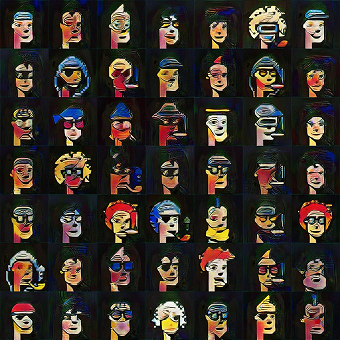

(Source: [CryptoPunks Picasso Style, Artonymous Artikfakt](https://twitter.com/artonymousart/status/1124808048453783553))


### Famous CryptoPunks Look-Alikes

[famouspunks.com](https://www.famouspunks.com/) -
a website dedicated to matching CryptoPunks with their celebrity lookalikes. You can find pretty decent matches for Hulk Hogan, John Waters, and, if you're being generous, Katy Perry in her blue hair days.

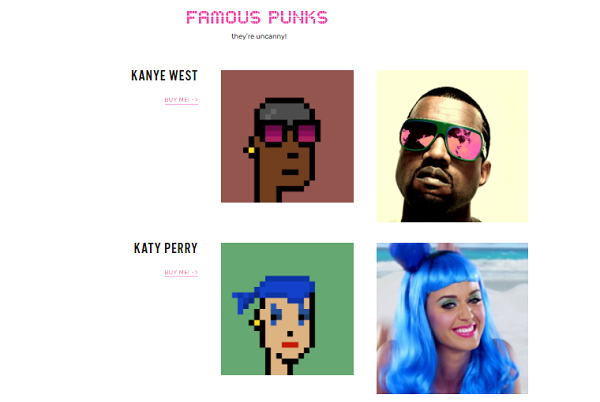


## Classic V1  - "First Deploy" - 10 000 More Punks

> When CryptoPunks launched, the contract was exploitable. 
> Sellers didn't get paid. LarvaLabs quickly launched a fixed version of the contract, which everyone uses.
>
> But the V1 tokens are still out there.

What about the CryptoPunks V1 Contract?

See [Inside the CryptoPunks V1 Blockchain Contract / Service »](https://github.com/cryptopunksnotdead/contracts/tree/master/punks-v1)

### Wrapped CryptoPunks V1 (WPUNKS1)

V1 punks are "wrapped" as "standardized" non-fungible tokens (ERC-721) for sale on  markets, see [Classic Punks](https://classicpunks.com/) for more.

Markets include:
- [Wrapped CryptoPunks V1 @ OpenSea](https://opensea.io/collection/wrapped-cryptopunks-v1)


What about the Wrapped CryptoPunks V1 (WPUNKS1) contract?

See [Inside the Wrapped CryptoPunks V1 (WPUNKS1) Blockchain Contract / Service »](https://github.com/cryptopunksnotdead/contracts/tree/master/wrapped-v1)


## Remakes

### CryptoPunks, Polkadot Edition ("SubstraPunks")

> In 2020, the devs created the artist - okay fine, the algo - who drew the Substrapunks, as an homage to Cryptopunks.
>
> The team didn't expect their hackathon project to have any value. Just like cryptopunks - they gave them away to anyone who claimed one.
>  It took a while. Not many people believed, and even fewer people expected them to ever be worth anything!
>
>  Soon, people started buying and selling them - there was no market.
>  Someone made an online spreadsheet page to keep track of prices & trades - that was v1 of the marketplace!
>  No one really knew the value of different traits - most were available for a few dollars, but some were already 3 figures.
>
> -- Substra Punkette, Hello World! The Story So Far, [January 2021](https://twitter.com/SubstraPunk/status/1350480927093358593)


CryptoPunks, Polkadot Edition ("SubstraPunks")
is a remake
on the Polkadot blockchain - contracts built with the Substra(te) machinery -
by Alexander Mitrovich & [Greg Zaitsev](https://github.com/gregzaitsev), [Usetech](https://github.com/usetech-llc), Moscow, Russia.


10 000 unique character images are generated from a brand new set of face parts.


> Punk images are auto-generated from 8 parts.
> Some of them are optional (like a beard or cigar), some are required (like the face).
> Some are uni-sex (like earrings or noserings), but some define the gender
> of the generated character (like lipstick or blonde hair for girls or a beard for boys).
> If the gender is not determined, the chance decides
> what it is going to be at the moment when they are generated.
> The component parts are:
>
> 1. Face (2 options: black and white)
> 2. Beard, optional (7 options)
> 3. Earrings, optional (3 options)
> 4. Eyes/sunglasses (5 options)
> 5. Hair (12 options)
> 6. Mouth (6 options)
> 7. Nose ring, optional (1 option)
> 8. Cigar or a pipe, optional
>
> The total combinations possible are 89 820, but the algorithm randomly picked 10 000 of them.

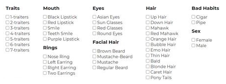

> I think a $1,000 USD price floor for Punks is going to happen, and probably this year.
>
> It sounds crazy, but that's 2.5 KSM per punk, and a KSM price of $400.
>
> Actually that sounds bearish!
> Considering punks have gone from 0.05 KSM to 1 KSM
> and Kusama (KSM) from $5 USD to $275 USD.
>
> Some updated market stats:
>
> - Total sales:  1352.23 KSM
> - Average price:  1.435488323
> - Highest Price:  75
>
> Approx. $3 million USD total market cap
>
> -- Substra Punkette, [February 2021](https://twitter.com/SubstraPunk/status/1363989463798587392)

<!--
  more sources:
   https://twitter.com/SubstraPunk/status/1363964943888957446
-->


Find the open source code on github @ [`usetech-llc/substrapunks`](https://github.com/usetech-llc/substrapunks). (Note: includes the art generation algorithm / code).


## Copypasta - Original or Copy? Cash Grab or Conceptual Art?

_Good artists copy, great artists steal.  -- Pablo Picasso_


### CryptoPunks, Binance Edition ("Bunks")

> Warning: There is a project called [CryptoPunks, Binance Edition] ("Binance Punks")
> that has taken the art from CryptoPunks and is selling it as a copy on another blockchain.
> This is in no way an authorized [Larva Labs] project.
>
> -- [February 2021](https://twitter.com/larvalabs/status/1364041628508434432)
>
> Isn't an unauthorized edition the true authentic punk edition? Fuck the [Larva Labs $$$] hipsters!
>
> -- Anonymous Punk


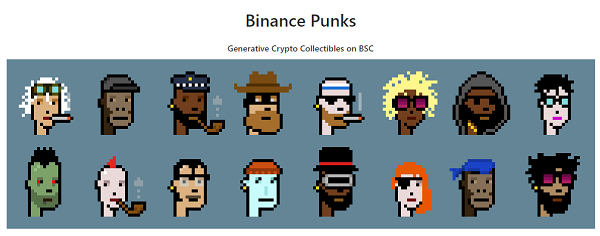

Why Binance Punks exists:

> The initial crypto punks distribution was free to claim punks.
> This made it so that a few early non-fungible token (NFT) fans had all the fun and have made millions.
> Now people are more aware of non-fungible tokens (NFTs).
> We want to give everyone on Binance Smart Chain (BSC) a chance to be a part.
>
> To buy a Crypto Punk costs $42,000 and to buy a Binance Punk costs $300. Punks for the people.
>
> This growth is insanity. Extremely unexpected. The winners have been selected!
> These punks sold out way faster than expected.
> 
> In two hours we sold 10,000 bunks for $2.5 million.
>
> -- [February 2021](https://twitter.com/bscbunks/status/1363598505231720449)
>

<!-- more sources
   https://twitter.com/bscbunks/status/1366887142060867594  
   https://twitter.com/bscbunks/status/1363680464536555521
   https://twitter.com/bscbunks/status/1364033622127353857
   https://twitter.com/bscbunks/status/1364039520254107651
  -->

- BinancePunksMarket Contract (incl. Source Code) @ [0x5EA899dBc8d3CDE806142a955806e06759B05fB8](https://bscscan.com/address/0x5EA899dBc8d3CDE806142a955806e06759B05fB8)


Updates:

> We are embracing the [Bunks] meme. Our site is now hosted at [bunks.on.fleek.co](https://bunks.on.fleek.co)
>
> -- [February 2021](https://twitter.com/bscbunks/status/1364726517134221316)
>
> Bunk #3100: Alien (1 of 9) just sold for $48,000.
>  
> -- [March 2021](https://twitter.com/bscbunks/status/1367340057888239616)


Find out more @ [**bunks.on.fleek.co »**](https://bunks.on.fleek.co)


## CryptoPunk #3100 - Conceptual Art Resale - Discuss: Can You Steal from A Robot? Who Cares About "Provenance"?  

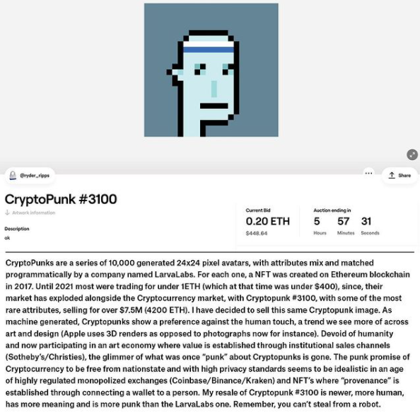

(Source: [Ryder Ripps @ Instagram](https://www.instagram.com/p/CQwdw5XLLwk/))

The copyright takedown letter by the million dollar Larva Labs fraudsters. How punk is that?
Can you copyright machine-generated images? 
Or how "original" is a 8-bit 24×24 pixel image that any 6-year old can redraw "by hand" in minutes?

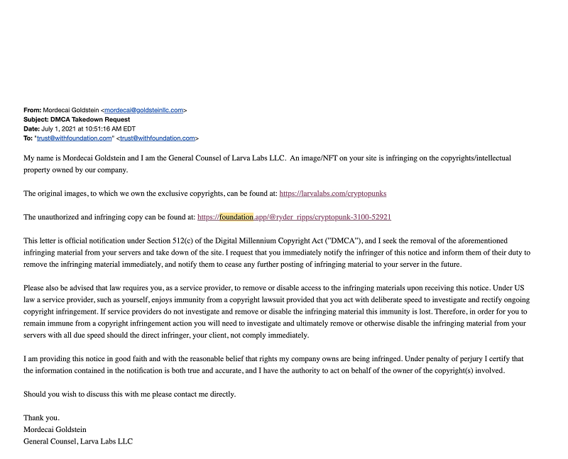

Ryder Ripps writes back:

> The claims of copyright violation should be rejected because:
>
> My use of the material is legally protected because it falls within
> the "fair use" provision of the copyright regulations.
> This work is transformative. If the complainant disagrees that this is
> fair use, they are free to take up the matter with me directly, in the courts.
> You, the Internet Service Provider (ISP), are under no obligation to settle
> this dispute, or to take any action to restrict my speech at the 
> behest of this complaint. [...]
>
> (Source: [Ryder Ripps @ Instagram](https://www.instagram.com/p/CQzlRL3LXXK/))


## CryptoPhunks Parody - Copyright (or Left) Wars

Phunks face left on the right side of history.

The purpose of CryptoPhunks is to poke fun at the high-brow, pompous group of people that are reflecting the "old-school" rules of art 
into this new frontier of art tokens. 
CryptoPhunks want to test the limits of "parody" and bias against centralized marketplaces, 
of provenance on the blockchain, censorship, while also setting out to unite strangers and collectors from around the space.

(Source: [The CryptoPhunks Manifesto](https://phunks.medium.com/the-cryptophunks-manifesto-785c7348e558))

> 1,357 Phunk family members and growing. You can't stop the phunk.
>
>  o o o
>
> [Pixel Art] tokens thrive because of an authentic and organic growth in their communities. 
> Were the CryptoPhunks original in their flipping of the punk art? Not really. 
> But did they manage to create an authentic communal experience? Yep. 
> I see them as parody, minimal as it may be, and a fun one.

<!--
 https://twitter.com/cryptophunks
 https://www.cryptophunks.com/
-->

And another copyright takedown letter by the million dollar Larva Labs fraudsters. How punk is that?

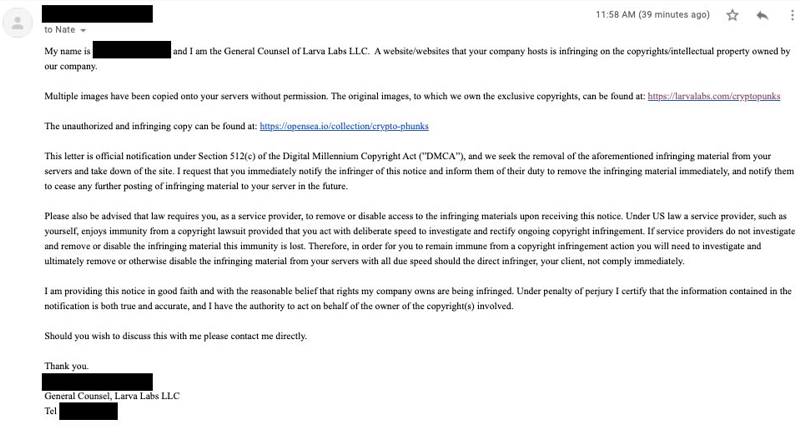


CryptoPhunks comments:

> The OpenSea [crypto art reseller market] has received a Digital Millennium Copyright Act (DMCA) [takedown] from Larva Labs. 
> We are witnessing copyright laws unilaterally applied in a [new crypto] world where decentralization 
> and provenance should be paramount. Ironically, Phunks are the real punks in this fight for censorship resistance. History in the making.
>
> o o o
>
>  Dear LaraLabs,
>  the art token community deserves to hear from you directly. 
>  Phunks parodied Punks and opened the doors for over 1,000 new owners who learned and enjoyed Punk's history and attributes. 
>  Punks value have also increased during this time. Why are you threatened by Phunks?
> There was never malicious intent in passing off a Phunk as a Punk. 
> 
> No one has reportedly been "scammed", because anyone that visited our site knew it was a parody. 
> As pioneers in the art token market, is provenance not one of your guiding principles? What is the goal
> behind the Digital Millennium Copyright Act (DMCA) takedown?
>
> (Source: [CryptoPhunks](https://twitter.com/cryptophunks), July 2021)


And follows-up with an open "Phunk is Punk" letter to Larva Labs:

> In the words of your co-founder Matt Hall, the blockchain "provides a layer of trust that removes the need for lawyers and middlemen." 
> But over the last several weeks, we've seen that your actions speak louder than these words. You have called for lawyers and 
> have ignored our public and private requests for an open dialogue regarding the DMCA issued to OpenSea requesting the delisting of CryptoPhunks.
>
> This letter aims to bring public attention to the issue(s) at hand. During these formative times in the NFT space, 
> CryptoPhunks aims to push boundaries in order to set the foundation for a future 
> where NFTs can leverage blockchain technology for its strengths: provenance and authenticity.
>
> Phunks poked fun at those who were applying the “old-school” rules of art into this new frontier of NFTs. 
> Deceptive and fraudulent copycats should be mitigated, but Phunks has been a clear parody from the start 
> with no reported cases of a user buying a Phunk thinking it was a Punk. In this project’s short lifespan thus far, 
> Phunks have brought in over 1,000 new holders who learned about the Punks’ attributes and history. 
> Some even went on to buy a Punk. Others are just happy to have joined a new and accessible community 
> that embraces the philosophies that web3 was built on.
>
> Larva Labs: have you entertained the perspective that altpunk projects create incremental value for Punks 
> by perpetually solidifying their legacy? Where do you draw the line on what is deemed parody and what is not? We’ve spoken with various attorneys who 
> have agreed that “parody” and “satire” are legal areas that currently stand unclear in light of lawsuits involving Andy Warhol’s work. 
> Do you believe that Warhol’s iconic Campbell’s Soup Cans and the commentary it generated crossed the line as well?
>
> Additionally, Larva Labs has not addressed their own community’s questions regarding IP ownership of Punks. 
> Do Punk owners have commercial rights to their Punks? Can Punk owners permit the Phunk of their Punk to exist? 
> Is Larva Labs planning to wipe a bunch of altpunk projects off of OpenSea now that they are a $100m+ company? 
> The NFT space, Punk Holders, and Phunk Holders need clarity, collaboration, 
> and forward thinkers to pave the way for a decentralized future.
>
> It’s time for an awakening in the NFT community. It’s time to stand up to censorship resistance, 
> for change beyond our pervasive web2 systems, and for true decentralization. 
> Phunks stand for these principles. What is truly punk can not be stopped. Long live Phunks, on the blockchain, forever.
>
> “If you don't believe me or don't get it, I don't have time to try to convince you, sorry.” - Satoshi
>
> Yours Trustlessly, <br>
> The Phunks

More about Phunks:

[**CryptoPhunks: Just a Flip or a Movement?**](https://hackernoon.com/cryptophunks-just-a-flip-or-a-movement-4p2o372t)
by Ani Alexander, July 2021


## History


CryptoPunk is one of the first "Non-Fungible Token" and was an inspiration for the Ethereum ERC-721 non-fungible token standard
that today powers most crypto art and collectibles on the blockchain.

How much did the punks cost when first released?  You could claim a punk (for "free")
that is, by simply paying the transaction fee of around 11 cents.
Now, you have to buy a punk from someone else and need to pay the market rate.

> With the CryptoPunks, where we gave away 9,000 of them, a large
>  number of them went to a few early people that just got on it and
> automated that process. -- Matt Hall ([April 2019](https://www.artnome.com/news/2019/4/08/autoglyphs-generative-art-born-on-the-blockchain))


**Genesis Story**

> CryptoPunks started with a pixel-art character generator Watkinson
> began playing with in December 2016. It randomly mixed a selection of characteristics (sunglasses, skin colors, hair types, and so on) to come up with 10,000 24-by-24-pixel "punks" - a characterization that nods to the early '90s cypherpunks, cofounded by the late Timothy May. None look exactly alike, and certain types of punks turned out to be rarer than others.
>
> [..]
>
> "We muddled our way through figuring out how an ERC-20
> token would look if it were not fungible," said Hall. After many attempts, they settled on putting the hash of each CryptoPunk's image file into its respective smart contract, including some "marketplace functions" that would allow people to buy and sell the Punks. They posted their project to the Ethereum subreddit and Hacker News and waited for people to notice. Very few did. About 100 claimed a Punk, which Hall and Watkinson offered for free.
>
> Then, in June 2017, the pair got in touch with Mashable and told them about CryptoPunks. "This Ethereum-based project could change how we think about digital art," read the headline above an image of a blond, glasses-wearing Punk with the caption, "Someone owns this picture."
>
> "Things went crazy," said Hall. "We went from having something like 8,600 CryptoPunks available to within 20 hours, they were all claimed." The pair had already reserved 1,000 for themselves "just in case it becomes a thing."
>
> Watkinson got in on the action. The day the Punks exploded, he sold one of his for a dollar. Someone bought it, so he sold another for $10. That sold, too, so he went up to $50, then $100. That same day, someone offered an alien Punk for 10 ether, which at the time was $3,000. "Boom, someone bought that," said Watkinson. "I was just like, whoaaa. The day before that, we were like, will anyone care?"
>
> (Source: [How CryptoPunks' Creators Charmed the Art World and Paved the Way for Blockchain Art](https://breakermag.com/how-cryptopunks-creators-charmed-the-art-world-and-paved-the-way-for-blockchain-art/) by Jessica Klein, Breaker Mag, January 2019)


## Articles

2017

[**This ethereum-based project could change how we think about digital art - Someone owns this picture.**](https://mashable.com/2017/06/16/cryptopunks-ethereum-art-collectibles/) by Jason Abbruzzese, Mashable, June 2017

2019

[**A Physical Model for Digital Art Ownership - The CryptoPunks in their First Gallery Show.**](https://www.larvalabs.com/blog/2019-2-1-15-1/a-physical-model-for-digital-art-ownership-the-cryptopunks-in-their-first-gallery-show) by Larva Labs, February 2019


[**CryptoPunks Two Year Anniversary - A look at the activity and trends over the first two years of the CryptoPunks.**](https://www.larvalabs.com/blog/2019-6-21-1-1/cryptopunks-two-year-anniversary) by Larva Labs, June 2019

2021

[**An Ethereum-based CryptoPunk Artwork Just Sold for $176,000. Owning a pixelated avatar of a knitted cap-wearing ape is a status symbol, argues the user who paid thousands for it.**](https://decrypt.co/53519/an-ethereum-based-cryptopunk-artwork-just-sold-for-176000) by
Liam Frost, Decrypt, January 2021


[**Ultra-rare alien CryptoPunk sells for 605 ETH, or $750,000. Is the market getting overheated?**](https://cointelegraph.com/news/ultra-rare-alien-cryptopunk-nft-sells-for-605-eth-or-750-000) by
Andrew Thurman, Coin Telegraph, January 2021


[**The Cult of CryptoPunks**](https://techcrunch.com/2021/04/08/the-cult-of-cryptopunks/) by Lucas Matney, Tech Crunch, April 2021 -- Ethereum's "oldest non-fungible token project" may not actually be the first, but it's the wildest

> One of the aliens [ [Punk #7804](https://www.larvalabs.com/cryptopunks/details/7804)] 
> was sold [for 4,200 Ether (about $7.5M)] [...] 
> a century from now the blocky image sold would be seen as the "Mona Lisa of digital art."
> 
> The pixelated alien portraits belonged to an non-fungible token platform called CryptoPunks. 
> In the world of non-fungible tokens, the platform is as close to ancient history as it gets,
>  meaning it’s almost four years old. 


[**10 things to know about CryptoPunks, the original Non-Fungible Tokens (NFTs)**](https://www.christies.com/features/10-things-to-know-about-CryptoPunks-11569-1.aspx), Christie's, April 2021

> For the first time, 5,184 pixels' worth of a revolutionary non-fungible token project will go up for auction 
> at a traditional auction house, courtesy of the project creators and pioneers [- Matt Hall and John Watkinson, founders of New York-based software company Larva Labs -] themselves.
>
> [...]
> 
>  The CryptoPunks are a collection of 24x24, 8-bit-style pixel art images of misfits and eccentrics. 
>  There are exactly 10,000 of them, each with their own ostensible personality 
>  and unique combination of distinctive, randomly generated features.
>
> [...]
>
> As of early April 2021, over 8,000 sales had been recorded in the previous 12 months, 
> with an average sale price of 15.45 ether ($30,412.40). 
> The total value of all sales is 127,360 ether ($251,620,000) - and that value grows daily.
>
> In February, CryptoPunk #6965, a fedora-wearing ape Punk, sold for 800 ether - equivalent to $1.5 million. 
> And on 11 March 2021, CryptoPunk #7804, the previously mentioned pipe-smoking "wise alien," 
> was sold for the equivalent of $7.5 million - the highest amount ever paid for a Punk at the time.   
>
> [...]
> 
> Larva Labs' set comprises nine CryptoPunks [[#2](https://www.larvalabs.com/cryptopunks/details/2), 
> [#532](https://www.larvalabs.com/cryptopunks/details/532), 
> [#58](https://www.larvalabs.com/cryptopunks/details/58), 
> [#30](https://www.larvalabs.com/cryptopunks/details/30), 
> [#635](https://www.larvalabs.com/cryptopunks/details/635), 
> [#602](https://www.larvalabs.com/cryptopunks/details/602), 
> [#768](https://www.larvalabs.com/cryptopunks/details/768), 
> [#603](https://www.larvalabs.com/cryptopunks/details/603), 
> [#757](https://www.larvalabs.com/cryptopunks/details/757)], all from their original collection [24 x 24 pixels each], 
> in a single lot that highlights the series' best features: muttonchops, earrings, big shades, crazy hair, a hoodie, a mohawk and more.
> [...]  
> Estimate: $7,000,000-9,000,0000. 
>  Offered in 21st Century Evening Sale on 13 May at Christie's in New York.


[**Christie's to Auction Off Nine CryptoPunks Non-Fungible Tokens**](https://decrypt.co/65929/christies-cryptopunks) by Will Gottsegen, Decrypt, April 2021 

> According to promotional materials, nine CryptoPunks are being auctioned together 
> in a single lot at the 21st Century Evening Sale on May 13. [Estimate: $7,000,000-9,000,0000.].


[**Ethereum User Bids $6.3 Million on 16 CryptoPunks Within Minutes**](https://decrypt.co/65993/ethereum-user-bids-6-3-million-on-16-cryptopunks-within-minutes) by Tim Copeland, Decrypt, April, 2021 -- Ahead of a Christie’s auction of nine CryptoPunks NFTs, one investor is prepared to pay big money to get his hands on a number of other Punks.

> It's worth taking these valuations with a pinch of salt.
> Since there are so few sales of CryptoPunks, but such high valuations,
> it's not impossible that investors are making sales among themselves to drive up the value of their non-fungible tokens. 
> This is one of the flipsides of the data being publicly available on the blockchain - it's accessible 
> to anyone around the world, but it's possible for people to hide their identity behind multiple addresses.


## Stats

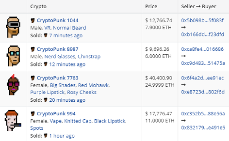

Sales Stats

- Number of Sales (Last 12 Months): 4 641
- Average Sale Price (Last 12 Months): 5.60 ETH (~$9 621)
- Total Value of All Sales (Lifetime): 25 990 ETH (~$45million)


Contract Stats

> The [CryptoPunksMarket] contract now holds 4,095 ETH (~$5.4M USD) in open bids and pending withdrawals. -- [Jan 26, 2021](https://twitter.com/larvalabs/status/1353915659453870080)


<!--
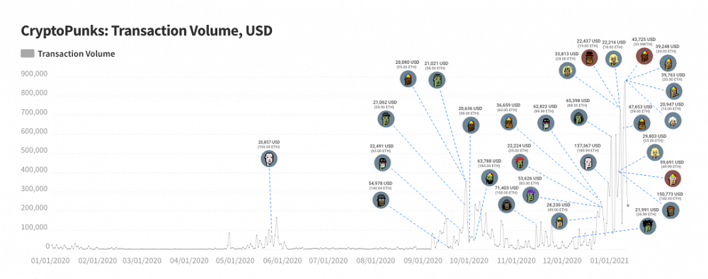
-->

