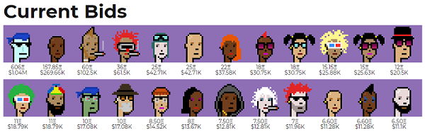

_Code on the Blockchain - Electronic Contract Scripts_


# Inside the CryptoPunksMarket Blockchain Contract / Service

> The [CryptoPunksMarket] contract now holds 4 095 ETH (~$5.4M USD)
> in open bids and pending withdrawals. -- [Jan 26, 2021](https://twitter.com/larvalabs/status/1353915659453870080)


Buy & Sell CryptoPunks - 24×24 Pixel Art Images


Note: The CryptoPunksMarket contract script is open source  with some inline running commentary
and more documentation on the github project page.
Thanks! The CryptoPunksMarket contract script is about 250 lines total.


## Source Code

CryptoPunkMarket @ Etherscan, see contract address [`0xb47e3cd837ddf8e4c57f05d70ab865de6e193bbb`](https://etherscan.io/address/0xb47e3cd837ddf8e4c57f05d70ab865de6e193bbb#code)

Contracts & More @
GitHub, see [cryptopunks @ larvalabs](https://github.com/larvalabs/cryptopunks)


### CryptoPunksMarket

#### Constants

You can use this hash to verify the image file containing all the punks

``` solidity
string public imageHash = "ac39af4793119ee46bbff351d8cb6b5f23da60222126add4268e261199a2921b";
```

The metadata details about the "CryptoPunks".

``` solidity
string public standard = 'CryptoPunks';
string public name     = "CRYPTOPUNKS";    // name for display purposes
string public symbol   = "Ͼ";              // symbol for display purposes
uint8 public decimals  = 0;                // amount of decimals for display purposes
uint256 public totalSupply = 10000;
```

#### Events

**Assign**

``` solidity
event Assign(address indexed to, uint256 punkIndex);
```

**Transfer**

``` solidity
event Transfer(address indexed from, address indexed to, uint256 value);
```

**PunkTransfer**

``` solidity
event PunkTransfer(address indexed from, address indexed to, uint256 punkIndex);
```
**PunkOffered**

``` solidity
event PunkOffered(uint indexed punkIndex, uint minValue, address indexed toAddress);
```
**PunkBidEntered**
``` solidity
event PunkBidEntered(uint indexed punkIndex, uint value, address indexed fromAddress);
```
**PunkBidWithdrawn**
``` solidity
event PunkBidWithdrawn(uint indexed punkIndex, uint value, address indexed fromAddress);
```
**PunkBought**
``` solidity
event PunkBought(uint indexed punkIndex, uint value, address indexed fromAddress, address indexed toAddress);
```
**PunkNoLongerForSale**
``` solidity
event PunkNoLongerForSale(uint indexed punkIndex);
```


#### Structs

**Offer**

``` solidity
struct Offer {
    bool    isForSale;
    uint    punkIndex;
    address seller;
    uint    minValue;       // in ether
    address onlySellTo;     // specify to sell only to a specific person
}
```

**Bid**

``` solidity
struct Bid {
    bool    hasBid;
    uint    punkIndex;
    address bidder;
    uint    value;
}
```


#### Storage

**punkIndexToAddress**

``` solidity
mapping (uint => address) public punkIndexToAddress;
```

**balanceOf**

This creates an array with all balances

``` solidity
mapping (address => uint256) public balanceOf;
```

**punksOfferedForSale**

 A record of punks that are offered for sale at a specific minimum value, and perhaps to a specific person

``` solidity
mapping (uint => Offer) public punksOfferedForSale;
```

**punkBids**

A record of the highest punk bid

``` solidity
mapping (uint => Bid) public punkBids;
```

**pendingWithdrawals**

``` solidity
mapping (address => uint) public pendingWithdrawals;
```


#### Payable Functions  - Ether (ETH) Accepted Here

**buyPunk**

Buy punk at the specified index.
Note: That punk needs to be previously offered for sale,
and you need to have sent at least the amount of ether specified
as the sale price for the punk.

``` solidity
function buyPunk(
  uint punkIndex
) payable
```

**enterBidForPunk  (and withdrawBidForPunk)**

Enters a bid for the punkIndex specified.
Send in the amount of your bid in the value field and we will hold that ether in escrow.

``` solidity
function enterBidForPunk(
  uint punkIndex
) payable
```

Will withdraw a bid for the specified punk and send you the ether from the bid.

``` solidity
function withdrawBidForPunk(
  uint punkIndex
)
```





#### Functions

**getPunk (Historic)**

To claim ownership of a punk.
Note: This is no longer useful as all 10 000 punks have been claimed!

``` solidity
function getPunk(
  uint punkIndex
)
```


**transferPunk**

Transfer ownership of a punk to someone without requiring any payment.

Note: For the case where there is a bid from the new owner refund it.

``` solidity
function transferPunk(
  address to, uint punkIndex
)
```

**acceptBidForPunk**

Accept a pending bid for the specified punk.
You can specify a minPrice in Wei to protect yourself from someone switching the bid for a lower bid.

``` solidity
function acceptBidForPunk(
  uint punkIndex, uint minPrice
)
```


**offerPunkForSale, offerPunkForSaleToAddress**

Offer one of your punks for sale to anyone willing
to pay the minimum price specified (in Wei).

``` solidity
function offerPunkForSale(
  uint punkIndex, uint minSalePriceInWei
)
```

Offer one of your punks for some minumum price,
but only to the address specified.
Use this to sell a punk to a specific person.

``` solidity
function offerPunkForSaleToAddress(
  uint punkIndex, uint minSalePriceInWei, address toAddress
)
```


**punkNoLongerForSale**

``` solidity
function punkNoLongerForSale(
  uint punkIndex
)
```


**withdraw**

Claim all the ether people have previously sent to buy your punks.

``` solidity
function withdraw()
```


(Source: [CryptoPunksMarket.sol](CryptoPunksMarket.sol))


